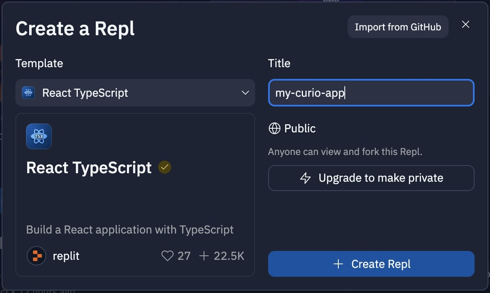
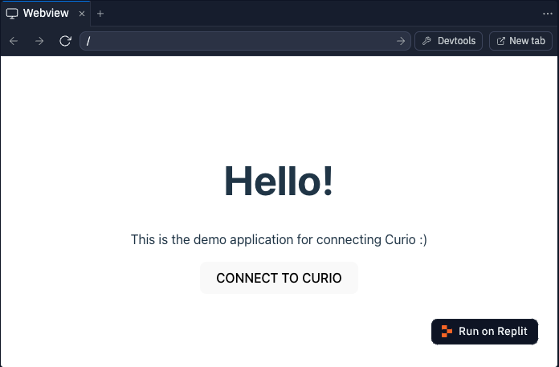
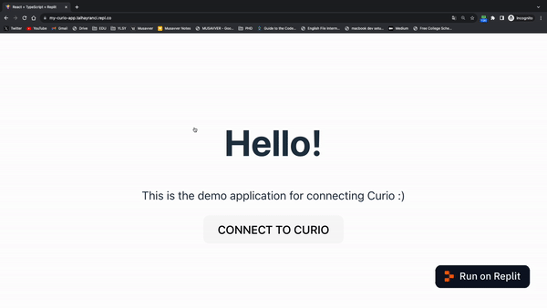
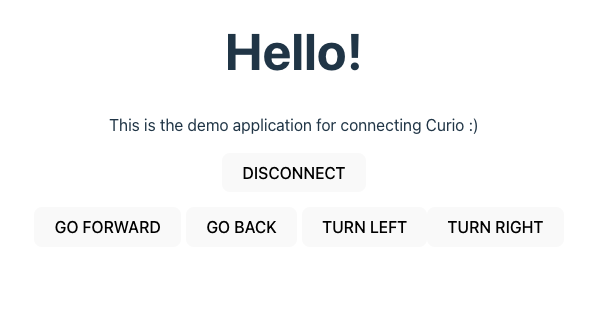

After we developed the first version of the Curio robot in the first half of 2023, several applications have been developed for with Curio (<a href="/projects/curio-joystick/" target="_blank">Joystick</a>, <a href="/projects/curio-teleoperation/" target="_blank">Teleoperation</a>, <a href="/projects/curio-drive-by-image" target="_blank">Drive By Image</a>). Some are basic while others are advanced.

If you are looking forward to using the Curio robot to create impresive applications, this guide is for you!

Curio comes with an <a href="https://www.espruino.com/Original" target="_blank">Espruino Board</a> that offers Blueotooth connectivity. Also, it is powered by JavaScript. Since Curio's processing unit is based on JS, the most effective way to build applications for it is by using web technologies.

While there are many JavaScript frameworks out there, this guide will focus on how to build a Curio application using React JS with Typescript.

## Getting Started

I will be using <a href="https://replit.com/" target="_blank">Replit</a> to create this template application. It's a web-based framework that simplfies application development by eliminating the need for complex setup. I strongly recommend you to use Replit. Especially if you're a fan of open-source and accessible development, you'll love Replit. However, if you prefer working on your local machine, don't worry – this guide has you covered with instructions for that too.

Here is the link for this template Repl: <a href="https://replit.com/@talhayranci/my-curio-app" target="_blank">my-curio-app</a>

So, lets get started!

### Creating Your Development Environment

To kickstart your Curio app development, you can choose from a couple of options for setting up your development environment.

#### Option 1: Using Repl

Create a new Repl with the React Typescript template and give it a cool name.



#### Option 2: Using Vite

Alternatively, you can use Vite to create a new React app. Here's how:

```shell
npm create vite@latest
Need to install the following packages:
create-vite@5.0.0
Ok to proceed? (y) y
✔ Project name: … my-curio-app
✔ Select a framework: › React
✔ Select a variant: › TypeScript
```

### Adding Espruino Tools

Once we've set up our development environment, the next step is to add Espruino Tools to your project. Espruino Tools is a valuable library that simplifies communication with Espruino devices.

```shell
npm install @espruino-tools/core
```

### Creating a Curio Class

Now, let's create a Curio class that will include basic functions to control Curio's movement. Creating a class makes it easier to manage and understand our code. Here's the class definition:

```javascript
import DeviceController from "@espruino-tools/core";

export class Curio extends DeviceController {
  constructor() {
    super();
  }

  public move(right: number, left: number, speed: number) {
    this.UART.write(`go(${right}, ${left}, ${speed})\n`);
  }

  public stop() {
    this.UART.write(`go(0, 0)\n`);
  }
}
```

This Curio class provides basic movement and stop functionality for your Curio robot. You can customize and extend these functions as needed for your specific project.

### Adding Connection Button

Now, we are ready to create some buttons to connect and control the robot. Our plan is to create a button for connecting to Curio, and after the connection is established, we will display movement buttons like "Go Forward", "Go Back", "Turn Left", and "Turn Right".

Let's start by adding a state to control the connection status and a function that handles the connection request in the App.tsx:

```javascript
const [isConnected, setIsConnected] = useState < boolean > false;
const curio = new Curio();

const handleConnect = () => {
  if (!isConnected) {
    curio.connect(() => {
      console.log('Connected!');
      setIsConnected(true);
    });
  } else {
    curio.disconnect(() => {
      console.log('Disconnected!');
      setIsConnected(false);
    });
  }
};
```

Next, let's add the UI elements for the connection:

```javascript
return (
  <>
    <div>
      <h1>Hello!</h1>
      <p>This is the demo application for connecting Curio :)</p>
      <button
        onClick={() => {
          handleConnect();
        }}
      >
        {isConnected ? 'DISCONNECT' : 'CONNECT TO CURIO'}
      </button>
    </div>
  </>
);
```

With these additions, you'll have a button that allows you to connect or disconnect from Curio.

I recommend adding some CSS styling to improve the visual appearance of your buttons. If you created the project with Vite, you might not need to write custom CSS. However, if you created the project on Repl, you can find the CSS code in the Repl link for this project.

Here's how the connection button might look like (with CSS applied):



When you run the project on Repl, it will show you the web view on the right panel. However, due to restrictions on using Bluetooth in iframes, you need to open it in a new tab by clicking the "New tab" button on the top right corner of the frame.

Let's try to connect to Curio now!



### Adding Movement Controls

Now, let's add movement controls for the Curio robot. Here's the function to implement movement controls:

```javascript
const handleMove = (right: number, left: number, speed: number) => {
  if (isConnected) {
    curio.move(right, left, speed);
  }
};
```

And here the UI codes:

```javascript
{
  isConnected && (
    <div style={{ marginLeft: '5px' }}>
      <button
        onClick={() => {
          handleMove(1000, 1000, 1000);
        }}
        style={{ marginLeft: '5px' }}
      >
        GO FORWARD
      </button>
      <button
        onClick={() => {
          handleMove(-1000, -1000, 1000);
        }}
        style={{ marginLeft: '5px' }}
      >
        GO BACK
      </button>
      <button
        onClick={() => {
          handleMove(1000, -1000, 1000);
        }}
        style={{ marginLeft: '5px' }}
      >
        TURN LEFT
      </button>
      <button
        onClick={() => {
          handleMove(-1000, 1000, 1000);
        }}
        style={{ marginTop: '15px' }}
      >
        TURN RIGHT
      </button>
    </div>
  );
}
```

These buttons allow you to control Curio's movement, including going forward, going back, turning left, and turning right. You can adjust the speed and behavior by modifying the handleMove function.

After adding all of them, it should look like this when connected:



Well done! You are now able to use your mobile phone (except iOS) or any devices to control Curio. You are now ready to create more with Curio!


