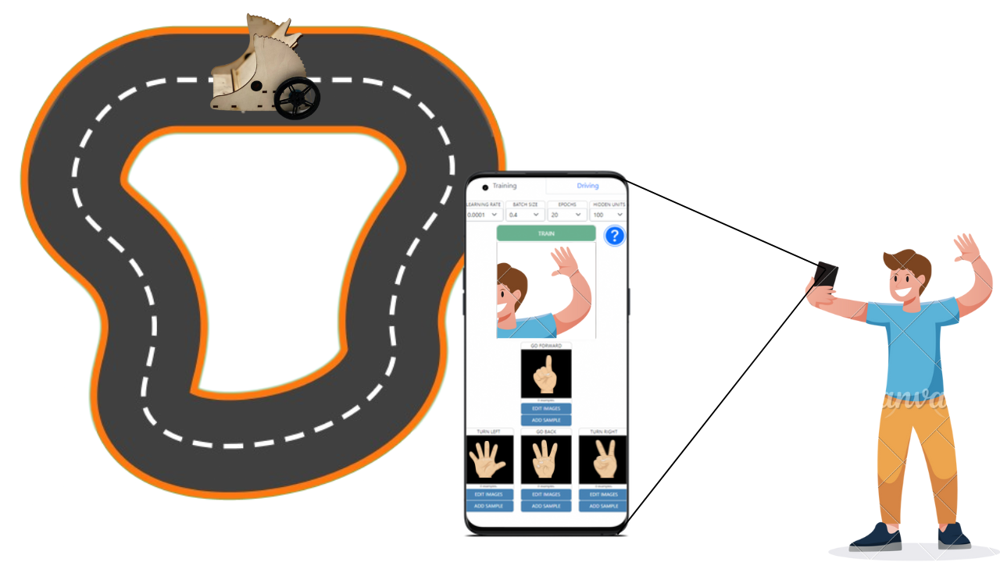

The Drive by Image project contributed to our understanding of the machine learning performance of smartphones. With this application, users can drive <a href="https://trycurio.com/" target="_blank">Curio</a> with the images captured with their smartphone camera.

Click <a href="https://drive-by-image.vercel.app/" target="_blank">this</a> link to use the system (If you are an iOS user, please use <a href="https://curio-host.vercel.app/" target="_blank">Curio Host</a>). There are instructions to use the application on the web site.

The project is written in ReactJS with Typescript. If you want to see the source codes, just check the project repo <a href="https://github.com/claretb/curio-teleoperation" target="_blank">here</a>. Feel free to explore!
