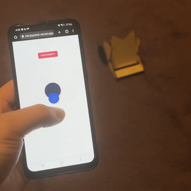
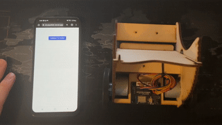

 
The Joystick project is based on the principle of maneuvering Curio using a smartphone or any device with a browser and Bluetooth capability (except iOS devices 😬, but don't worry <a href="https://curio-host.vercel.app/" target="_blank">Curio Host</a> is the solution). It's actually nothing more than a joystick for you but it's the beginning of everything for <a href="https://trycurio.com/" target="_blank">Curio</a>.

 Click <a href="https://curio-joystick.vercel.app/" target="_blank">this</a> link to use the joystick. Here how you can connect it:

 

The project is written in ReactJS with Typescript. If you want to see the source codes, just check the project repo <a href="https://github.com/claretb/curio-joystick" target="_blank">here</a>. The project codes might feel you a bit confused since it also includes the iOS integration. Feel free to explore!
