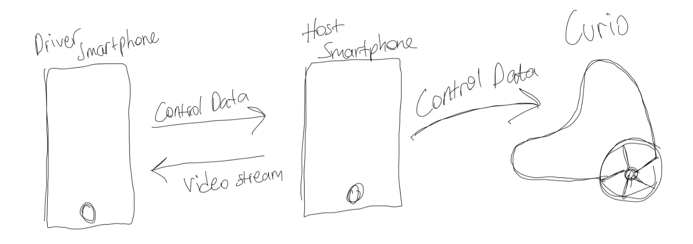

 

The Teleoperation project aims to provide real-time visual feedback to a secondary controlling device through a smartphone mounted on <a href="https://trycurio.com/" target="_blank">Curio</a>. This allows a user from anywhere in the world to remotely control the robot.

As you can see on the chart above, there are two mobile devices needed for this project with Curio. One of them as the host device on the robot and the other as the controller. Unfortunately, currently only an Android device can be the host device. iOS devices can be used as the controller.

Click <a href="https://curio-teleoperation.vercel.app/" target="_blank">this</a> link to use the system. Here how you can use it:

 

- Open the application (<a href="https://curio-teleoperation.vercel.app/" target="_blank">this</a>) website on the Host device.
- Scan the QR code with the Controller device and click the button to connect to the Host.
- Click "START VIDEO" button on Host.
- Click "CONNECT TO CURIO" button on Controller and establish the connection through Host device.
- Enjoy!

The project is written in ReactJS with Typescript. If you want to see the source codes, just check the project repo <a href="https://github.com/claretb/curio-teleoperation" target="_blank">here</a>. Feel free to explore!
